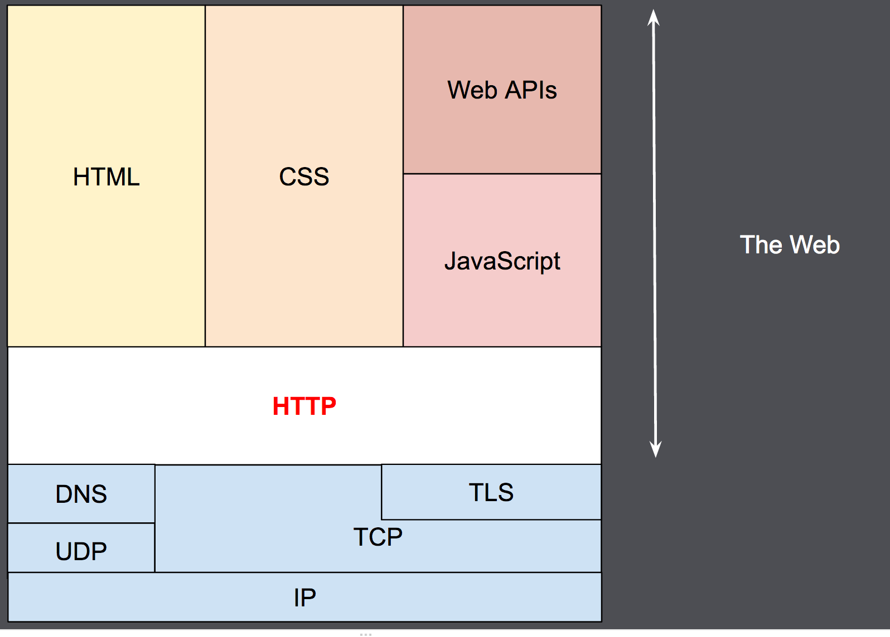

# HTTP 超文本传输协议

---

- [Cookie](./cookie.md)
- [CORS](./CORS.md)
- [HSTS](./HSTS.md)
- [Security](./security.md)
- [X-Content-Type](./xcontenttypeoptions.md)
- [CSP](./csp.md)
- [Authentication](./authentication.md)
- [Caching](./cache.md)

---

- `HTTP`

  - 应用层协议
  - 无状态协议
  - 客户端-服务器协议
  - `request`
    - 是客户端发出的消息
  - `response`
    - 服务端的响应消息
      
  - `user-agent` 就是任何能够为用户发起行为的工具
  - `Proxy`
    - 缓存
    - 过滤
    - 负载均衡
    - 认证
    - 日志记录
  - `headers`http 标头
    - http 本质没有状态，但将 cookie 加入 header,能够让请求共享相同的上下文，达成相同的状态
  - 常见传输层协议
    - `TCP`可靠的
    - `UDP`不可靠
  - http 请求

    - 在客户端（通常指浏览器）与服务器能够交互（客户端发起请求，服务器返回响应）之前，必须在这两者间建立一个 TCP 链接，打开一个 TCP 连接需要多次往返交换消息（因此耗时）。HTTP/1.0 默认为每一对 HTTP 请求/响应都打开一个单独的 TCP 连接。当需要连续发起多个请求时，这种模式比多个请求共享同一个 TCP 链接更低效。

    - 为了减轻这些缺陷，HTTP/1.1 引入了流水线（被证明难以实现）和持久连接的概念：底层的 TCP 连接可以通过  [`Connection`](https://developer.mozilla.org/zh-CN/docs/Web/HTTP/Headers/Connection)  标头来被部分控制。HTTP/2 则发展得更远，通过在一个连接复用消息的方式来让这个连接始终保持为暖连接。

  - HTTP 控制的常见特性
    - 缓存
    - 开放同源限制
    - 认证
    - 代理与隧道
    - 会话
  - 一个 HTTP 请求由一下部分组成请求报文
    - http 请求方法
      - GET
      - POST
      - OPTIONS
      - HEAD
    - 要获取的资源路径
      - 不包括 protocol(http://),domain(developer.mozilla.org),port(tcp port)
    - HTTP 协议版本号
    - 为服务端表达其他信息的可选标头
    - 对于一些像 POST 这样的方法，报文的主体（body）就包含了发送的资源，这与响应报文的主体类似。
  - 响应报文包含了下面的元素
    - HTTP 协议版本号
    - 一个状态码，来告知对应请求执行成功或失败，以及失败的原因。
    - 一个状态信息，这个信息是非权威的状态码描述信息，可以由服务端自行设定
    - HTTP [标头](https://developer.mozilla.org/zh-CN/docs/Web/HTTP/Headers)，与请求标头类似
    - 可选项，比起请求报文，响应报文中更常见地包含获取资源的主体
  - 基于 HTTP 的 API
    - XMLHttpRequest
    - Fetch API
    -

- 7 层架构 OSI 模型
  - 物理层
  - 数据链路层
  - 网络层
  - 传输层
  - 会话层
  - 表示层
  - 应用层
- 5 层模型 TCP/IP
  - 物理层
  - 数据链路层
  - 网络层
  - 传输层
  - 应用层

---

## HTTP 历史

- http/1.0 1996
  - 协议版本信息现在会随着每个请求发送
  - 状态码会在响应开始时发送，使浏览器能了解请求执行成功或失败，并相应调整行为（如更新或使用本地缓存）。
  - 引入了 HTTP 标头的概念，无论是对于请求还是响应，允许传输元数据，使协议变得非常灵活，更具扩展性。
  - 在新 HTTP 标头的帮助下，具备了传输除纯文本 HTML 文件以外其他类型文档的能力（凭借  [`Content-Type`](https://developer.mozilla.org/zh-CN/docs/Web/HTTP/Headers/Content-Type)  标头）。
- http/1.1 1997
  - 连接可以复用，节省了多次打开 TCP 连接加载网页文档资源的时间
  - 增加管线化技术，允许在第一个应答被完全发送之前就发送第二个请求，以降低通信延迟。
  - 支持响应分块
  - 引入额外的缓存控制机制
  - 引入内容协商机制，包括语言、编码、类型等。并允许客户端和服务器之间约定以最合适的内容进行交换
  - 凭借  [`Host`](https://developer.mozilla.org/zh-CN/docs/Web/HTTP/Headers/Host)  标头，能够使不同域名配置在同一个 IP 地址的服务器上
- http/2
  - 1.1
    - 需要请求以正确的顺序发送
  - HTTP/2 是二进制协议而不是文本协议。不再可读，也不可无障碍的手动创建，改善的优化技术现在可被实施。
  - 这是一个多路复用协议。并行的请求能在同一个链接中处理，移除了 HTTP/1.x 中顺序和阻塞的约束。
  - 压缩了标头。因为标头在一系列请求中常常是相似的，其移除了重复和传输重复数据的成本。
  - 其允许服务器在客户端缓存中填充数据，通过一个叫服务器推送的机制来提前请求。

## HTTP 消息

### 请求

- 起始行：三个元素组成
  - HTTP 方法
    - GET、PUT、POST、HEAD、OPTIONS、DELETE
  - 请求目标 URL/路径
  - HTTP 版本
    - 定义了剩余消息的结构，作为对期望的响应版本的指示符
- 标头 Header
  - 通用标头
  - 请求标头
  - 表示标头
- 主体 Body
  - 单一资源主体
  - 多资源主体

### 响应

- 状态行
  - 协议版本
  - 状态码
  - 状态文本
- 标头
  - 通用标头
  - 请求标头
  - 表示标头
- 主体
  - 单资源（Single-resource）主体，由**已知**长度的单个文件组成。
  - 单资源（Single-resource）主体，由**未知**长度的单个文件组成
  - 多资源主体

### HTTP/2 帧

- HTTP/1.x 消息有一些性能上的缺点
  - 与主体不同，标头不会被压缩。
  - 两个消息之间的标头通常非常相似，但它们仍然在连接中重复传输
  - 无法多路复用。当在同一个服务器打开几个连接时：TCP 热连接比冷连接更加有效。

## 典型的 HTTP 会话

- ## 客户端建立一条 TCP 连接
- 客户端发送请求并等待应答
- 服务器处理请求并送回应答，回应包括一个状态码和对应的数据
  > 从 HTTP/1.1 开始，连接在完成第三阶段后不再关闭，客户端可以再次发起新的请求。这意味着第二步和第三步可以连续进行数次。

## 响应状态码

- 信息型响应/1
- 成功响应/2
- 重定向/3
- 客户端错误/4
- 服务端错误/5

## HTTP/1.x 的连接管理

在 HTTP/1.x 里有多种模型：

- 短连接，http1.0 默认，`Connection:close`
- 长连接，http1.1 默认，`Keep-Alive`
- HTTP 流水线
